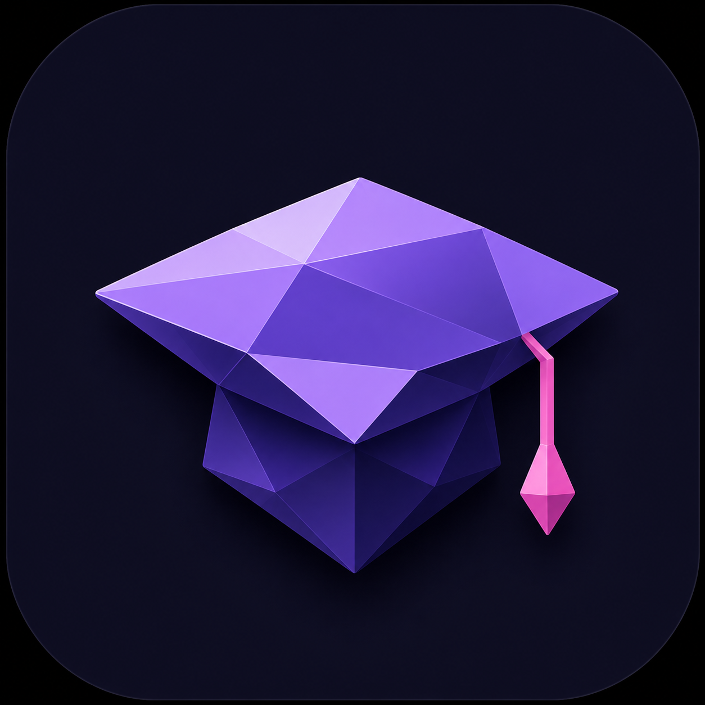

<div align="center">
  
</div>

<p align="center">
  
  
  
  
</p>

# Rubium

**Rubium** — open-source образовательная платформа для подготовки к ЕГЭ/ОГЭ.

От студентов для студентов. Не просто пет-проект — живой продукт, которым пользуются реальные люди.

## 📜 Лицензия

Этот проект распространяется под лицензией **Apache License 2.0**. Подробности в файле [LICENSE](LICENSE).

## Стек

| Слой       | Технологии                    |
| ---------- | ----------------------------- |
| Frontend   | Vue 3, Vite, Pinia, TipTap    |
| Backend    | Go (gin), Python              |
| Database   | Supabase (PostgreSQL)         |
| Rendering  | KaTeX                         |
| Auth       | Supabase Auth                 |

## Структура

```
frontend/  — Vue 3 SPA
backend/   — Go API, Python
```

## Команда

| Имя           | Роль             | GitHub                          | Telegram         |
| ------------- | ---------------- | ------------------------------- | ---------------- |
| Илья Емельянов | Lead Developer  | [nsdmlk](https://github.com/nsdmlk) | [@KantervilleGhost](https://t.me/KantervilleGhost) |
| Дима Киселёв  | Lead Developer     | [qqwozz](https://github.com/qqwozz) | [@onixxed](https://t.me/onixxed) |
| Олег Ветер | DevOps    | [veter22](https://github.com/veter22) | [@oveterr](https://t.me/oveterr) |

## Контрибьюторам

Хочешь получить реальный опыт разработки? Присоединяйся к [Rubium Tech](https://t.me/+5KS-7mS6aDw0NDJi) — закрытое комьюнити, где мы выдаём задачи из живого проекта, даём контрибуторство и помогаем расти.

## Связь

- [Rubium](https://t.me/rubium_edu) — новости и обновления
- [Rubium Tech](https://t.me/+5KS-7mS6aDw0NDJi) — комьюнити разработчиков

---

**Rubium** — строй будущее вместе с нами.
---
