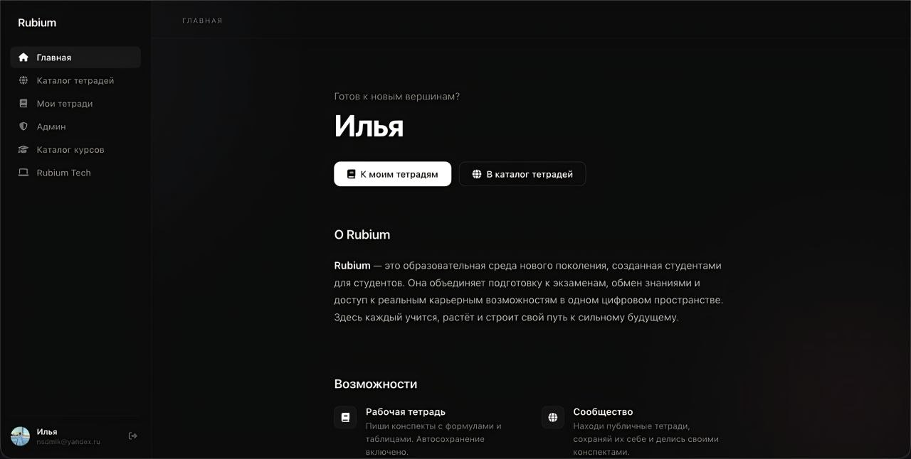

<div align="center">
  
</div>
<br>
<p align="center">
  
  
  
  
</p>

# Rubium

**Rubium** — это *open-source* образовательная среда нового поколения, созданная студентами для студентов.

<br>

<div align="center">
  
</div>

## 📜 Лицензия

Этот проект распространяется под лицензией **Apache License 2.0**. Подробности в файле [LICENSE](LICENSE).

## Стек

| Слой  | Технологии       |
| --------- | -------------------------- |
| Frontend  | Vue 3, Vite, Pinia, TipTap |
| Backend   | Go (gin), Python           |
| Database  | Supabase (PostgreSQL)      |
| Rendering | KaTeX                      |
| Auth      | Supabase Auth              |

## Структура

```
frontend/  — Vue 3 SPA
backend/   — Go API, Python
bot/       — Bots
```

## Контрибьюторам

Хочешь получить реальный опыт разработки? Присоединяйся к [Rubium Tech](https://t.me/+5KS-7mS6aDw0NDJi) — закрытое комьюнити, где мы выдаём задачи из живого проекта, даём контрибуторство и помогаем расти.

## Связь

- [Rubium](https://t.me/rubium_edu) — новости и обновления
- [Rubium Tech](https://t.me/+5KS-7mS6aDw0NDJi) — комьюнити разработчиков

---

**Rubium** — строй будущее вместе с нами.
-------------------------------------------------------------
